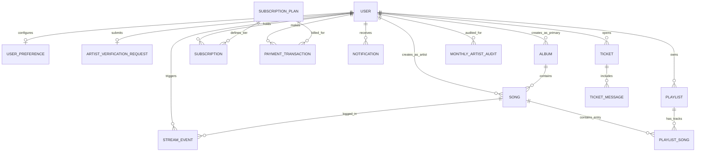
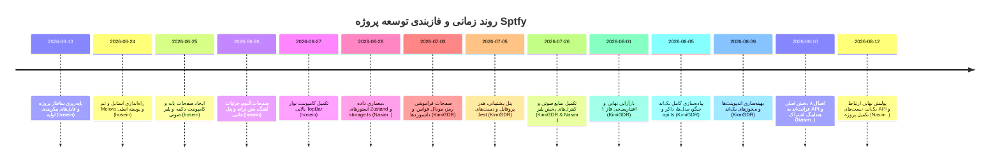

# گزارش نهایی، دقیق، مستند و دانشگاهی پروژه Sptfy (Melora)

---

## روش بررسی و سطح اطمینان (Methodology & Confidence Level)

این گزارش بر اساس تحلیل سیستماتیک و مبتنی بر شواهد قطعی (**Evidence-Based**) از روی سورس‌کد واقعی مخزن گیت، تاریخچه کامل کامیت‌ها (Git Commit History)، تفاضل تغییرات فایل‌ها (Diff)، ساختار پیکربندی و فایل‌های تست پروژه تهیه شده است.

### ابعاد و منابع بررسی‌شده:
1. **تاریخچه کامل گیت:** تحلیل تمامی ۱۷ کامیت ثبت‌شده در شاخه اصلی پروژه از تاریخ ۲۰۲۶-۰۶-۱۳ تا ۲۰۲۶-۰۸-۱۲ شامل هش کامیت‌ها، نویسندگان (Authors)، پیام‌ها (Commit Messages)، تاریخ‌ها و آمار فایل‌های تغییریافته (Numstat).
2. **بررسی شاخه‌ها و ادغام‌ها:** بررسی خروجی دستورات `git branch -a` و `git log --merges` جهت تشخیص استراتژی شاخه‌بندی و عدم وجود Merge Commitهای صریح.
3. **سورس‌کد فرانت‌اند (Frontend):** مطالعه دقیق فایل‌های واقع در دایرکتوری [`src/`](file:///d:/FOP/sptfy/src) شامل صفحات App Router، مؤلفه‌ها (Components)، هوک‌ها و توابع کمکی، مدیریت وضعیت (Zustand Stores در [`src/store/`](file:///d:/FOP/sptfy/src/store))، پایگاه داده محلی ماک ([`src/lib/storage.ts`](file:///d:/FOP/sptfy/src/lib/storage.ts))، کلاینت ارتباط با وب‌سرویس ([`src/lib/api.ts`](file:///d:/FOP/sptfy/src/lib/api.ts)) و تعاریف تایپ‌ها ([`src/types/index.ts`](file:///d:/FOP/sptfy/src/types/index.ts)).
4. **سورس‌کد بک‌اند (Backend):** بررسی جامع اپلیکیشن‌های ماژولار جنگو در دایرکتوری [`backend/`](file:///d:/FOP/sptfy/backend) شامل `accounts`, `music`, `billing`, `community`, `operations`, `common`, `melora_backend` و ماژول آزمون‌ها ([`backend/tests/test_api.py`](file:///d:/FOP/sptfy/backend/tests/test_api.py)).
5. **پیکربندی محیط و کانتینرسازی:** بررسی فایل‌های [`Dockerfile`](file:///d:/FOP/sptfy/Dockerfile)، [`docker-compose.yml`](file:///d:/FOP/sptfy/docker-compose.yml)، [`backend/Dockerfile`](file:///d:/FOP/sptfy/backend/Dockerfile)، [`package.json`](file:///d:/FOP/sptfy/package.json) و [`backend/requirements.txt`](file:///d:/FOP/sptfy/backend/requirements.txt).
6. **مجموعه آزمون‌ها (Testing Suites):** بررسی ۱۱ فایل آزمون فرانت‌اند در پوشه [`tests/`](file:///d:/FOP/sptfy/tests) با Jest/React Testing Library و فایل تست جامع بک‌اند با `APITestCase`.

### محدودیت‌های تحلیل:
* به دلیل در دسترس نبودن لاگ‌های سرور ابری گیت‌هاب (مانند GitHub Issues و PR Discussions خصوصی)، بررسی تعاملات درون‌تیمی صرفاً از طریق پیام‌ها، نویسندگان و تغییرات کدهای Git History انجام پذیرفته است.
* هیچ فرضیه اثبات‌نشده‌ای مبنای گزارش قرار نگرفته و در صورت عدم تطابق مشخصات مصوب با کد واقعی، مغایرت‌ها به تفکیک ثبت شده‌اند.

---

## ۱. مقدمه
پروژه **Sptfy (Melora)** یک سامانه جامع و مدرن پخش و مدیریت محتوای موسیقی مبتنی بر وب است که در قالب دو فاز توسعه طراحی شده است. فاز نخست بر معماری فرانت‌اند واکنشی (Responsive)، طراحی سیستم رابط کاربری یکپارچه و منطق شبیه‌سازی داده در سمت کلاینت (Mock Database / LocalStorage) تمرکز داشته و فاز دوم بر مهاجرت به معماری واقعی مبتنی بر سرویس، توسعه بک‌اند قدرتمند با Django REST Framework، کانتینرسازی با Docker و یکپارچه‌سازی کامل جریان داده میان فرانت‌اند و بک‌اند استوار است.

این سند به عنوان گزارش دفاعیه جامع دانشگاهی، به تحلیل ساختار فنی، ارزیابی تحقق نیازمندی‌ها، سنجش مشارکت اعضای تیم، تحلیل مدل‌های داده و بررسی نگهداری‌پذیری سیستم می‌پردازد.

---

## ۲. معرفی پروژه
سامانه **Melora (Sptfy)** یک پلتفرم پخش آنلاین موسیقی چندنقشی (Multi-Role) با سطوح دسترسی سلسله‌مراتبی و سیستم اشتراک چندلایه‌ای است. این پلتفرم قابلیت تعامل هم‌زمان چهار گروه کاربری شامل **شنوندگان (Listeners/Users)**، **هنرمندان (Artists)**، **پشتیبانان (Supporters)** و **مدیران ارشد (Administrators)** را فراهم می‌آورد. 

رابط کاربری مدرن پروژه بر پایه هویت بصری «Melora Design System» همراه با پس‌زمینه‌های شیشه‌ای (Glassmorphism)، انیمیشن‌های نرم، حالت تاریک (Dark Mode) و پالت رنگی جذاب پیاده‌سازی شده است.

---

## ۳. اهداف پروژه
1. ایجاد یک تجربه پخش موسیقی تعاملی و بی‌وقفه با امکاناتی نظیر صف پخش (Queue)، حالت تصادفی (Shuffle)، تکرار (Repeat)، نمایش متن ترانه (Lyrics) و مینی‌پلییر واکنشی.
2. پیاده‌سازی سازوکار ثبت‌نام تفکیک‌شده برای کاربران عادی و هنرمندان به همراه فرم‌های اعتبارسنجی مدارک و پیش‌نمایش آثار هنری.
3. تفکیک نقش‌ها و سطوح اشتراک (Free, Silver/Standard, Gold) و اعمال قوانین تجاری سخت‌گیرانه (مانند سقف ساخت پلی‌لیست، سقف پخش روزانه، و دسترسی به آهنگ‌های زودهنگام Gold Early Access).
4. تفکیک معماری رابط کاربری (UI Layer) از منطق داده (Data Layer) به منظور تسهیل اتصال بدون دردسر از لایه موک به بک‌اند جنگو.
5. ارائه داشبوردهای مدیریتی، مالی، حسابرسی ماهانه هنرمندان (Artist Audits) و مرکز پشتیبانی و تیکتینگ.
6. آماده‌سازی محیط استقرار با داکر برای پایگاه‌داده PostgreSQL، سرور API جنگو و فرانت‌اند Next.js.

---

## ۴. Specification و نیازمندی‌های Phase 1
طبق مشخصات رسمی فاز ۱، اهداف اصلی شامل موارد زیر بوده است:
* پیاده‌سازی فرانت‌اند کامل با Next.js و Tailwind CSS بر اساس تم Melora.
* مدیریت وضعیت داده‌ها و احراز هویت به صورت Client-Side از طریق [`src/lib/storage.ts`](file:///d:/FOP/sptfy/src/lib/storage.ts) با استفاده از `localStorage`.
* پوشش تمامی صفحات مورد نیاز: ورود، ثبت‌نام، بازیابی رمز عبور، پنجره خط‌مشی حریم خصوصی، فرم ثبت‌نام هنرمند، مرکز اعلان‌ها، جزئیات آلبوم و آهنگ، پروفایل هنرمند و کاربر، داشبورد مدیریت و پنل پشتیبانی.
* کنترل محدودیت‌های دسترسی کاربران براساس پلن‌های اشتراک (Free: ۶ پلی‌لیست و محدودیت استریم؛ Standard/Silver: ۱۰۰ پلی‌لیست؛ Gold: دسترسی نامحدود).
* قابلیت جستجو و مرتب‌سازی آهنگ‌ها و آلبوم‌ها براساس تعداد شنوندگان و تاریخ انتشار.
* حداقل ۱۰ آزمون فرانت‌اند با فریمورک Jest.

---

## ۵. Specification و نیازمندی‌های Phase 2
طبق مشخصات رسمی فاز ۲، سیستم موظف به جایگزینی Mock Data با بک‌اند واقعی شده است:
* پیاده‌سازی بک‌اند با Python و Django REST Framework.
* پایگاه‌داده رابطه‌ای PostgreSQL با مدل‌های جامع برای کاربران، آلبوم‌ها، قطعات صوتی، پلی‌لیست‌ها، اشتراک‌ها، تراکنش‌های مالی، اعلان‌ها، تیکت‌های پشتیبانی، درخواست‌های تایید هنرمند و حسابرسی ماهانه.
* پیاده‌سازی منطق Fat Services / Thin Views جهت کپسوله‌سازی قوانین تجاری در لایه Service.
* ارائه Endpoints کامل RESTful با کدهای وضعیت استاندارد HTTP، صفحه‌بندی (Pagination) و فیلترینگ.
* اعمال لایه اعتبارسنجی دسترسی‌ها (Hierarchical Role & Tier Permissions).
* پیاده‌سازی درگاه پرداخت شبیه‌سازی‌شده (Sandbox Payment Gateway) با امکان خرید اشتراک‌های ۱، ۳، ۶ و ۱۲ ماهه.
* کانتینرسازی کامل با Dockerfile و `docker-compose.yml` برای سرویس‌های Database, Backend و Frontend.
* پیاده‌سازی آزمون‌های یکپارچه و اندپوینت‌های بک‌اند با حداقل ۱۵ تست.

---

## ۶. نقش اعضای تیم در Phase 1 (بر اساس Specification رسمی)
* **Person 1 (UI/UX, Responsive Design and Media Experience):** طراحی سیستم دیزاین Melora، لایه‌بندی واکنش‌گرا (Desktop/Tablet/Mobile)، پلیر صوتی پیشرفته، مینی‌پلییر، کنترل صف پخش، شافل، ریپیت، لیریکس، پروفایل کاربر، صفحه تنظیمات و تست‌های مؤلفه UI.
* **Person 2 (Authentication and Dashboards):** صفحات لاگین، ثبت‌نام، فراموشی رمز عبور، مودال حریم خصوصی، فرم ثبت‌نام آرتیست، داشبورد ادمین، سیستم تیکتینگ، داشبورد آرتیست و تست‌های تعاملی.
* **Person 3 (Data Architecture and State Management):** طراحی ساختار داده و تایپ‌ها، پایگاه‌داده موک در `storage.ts`، سیستم‌های جستجو و فیلتر، سیستم فالو/آنفالو، اعمال محدودیت‌های اشتراک، مدیریت استورهای Zustand (`authStore.ts` و `playerStore.ts`) و تست‌های استور و منطق داده.

---

## ۷. نقش اعضای تیم در Phase 2 (بر اساس Specification رسمی)
* **Person 1 (Backend Infrastructure, Auth and Media):** پیکربندی پایه جنگو، تنظیمات دیتابیس PostgreSQL، فایل‌های Docker، اپلیکیشن Accounts و احراز هویت، اعتبارسنجی سلسله‌مراتبی، آپلود رسانه‌ها و تصاویر پروفایل/کاورها.
* **Person 2 (Music Domain, Subscriptions and Payments):** اپلیکیشن‌های Music (آهنگ و آلبوم)، Playlists، Subscriptions و Payments، منطق CRUD، محدودیت‌های اشتراک، قیمت‌گذاری پویا و درگاه سندباکس.
* **Person 3 (Reporting, Notifications, Support and Integration):** اپلیکیشن‌های Notifications، Reports، Support، مدل‌های تیکت و فرایند تایید آرتیست، محاسبات تجمیعی گزارش‌ها، یکپارچه‌سازی فرانت‌اند با API و تست‌های پایانی.

---

## ۸. معماری Frontend
فرانت‌اند با فریمورک **Next.js 15 (App Router)** و **React 18** توسعه یافته است:

```
src/
├── app/                  # مسیریابی بر پایه پوشه‌بندی App Router
│   ├── (auth)/           # صفحات احراز هویت (login, register)
│   ├── (main)/           # صفحات اصلی و پنل‌های کاربری (albums, artists, playlists, profile, settings, songs, support, users)
│   ├── admin/            # داشبورد مدیریت سامانه
│   ├── artist/           # استودیوی اختصاصی بارگذاری و آمار هنرمند
│   ├── forgot-password/  # بازیابی رمز عبور
│   ├── notifications/    # مرکز اعلان‌ها
│   ├── reset-password/   # تایید و بازنشانی رمز عبور
│   ├── globals.css       # تعاریف متغیرهای رنگی و تم Melora
│   └── layout.tsx        # پوسته والد مشترک به همراه پلیر شناور
├── components/           # کامپوننت‌های ماژولار و قابل استفاده مجدد
│   ├── auth/             # مؤلفه‌های احراز هویت و مودال قوانین
│   ├── common/           # دکمه‌ها و عناصر پایه UI
│   ├── layout/           # نوار ناوبری بالا و زنگوله اعلان‌ها
│   ├── player/           # پلیر اصلی و پنل جانبی صف/متن ترانه
│   └── profile/          # سربرگ و نمایشگر اطلاعات کاربری
├── lib/                  # کتابخانه‌ها و لایه دسترسی به داده
│   ├── api.ts            # کلاینت ارتباط با REST API بک‌اند
│   └── storage.ts        # دیتابیس لوکال‌استوریج فاز ۱ (مکانیزم Fallback)
├── store/                # مدیریت وضعیت سراسری (State Management)
│   ├── authStore.ts      # استور Zustand احراز هویت و سطوح کاربری
│   └── playerStore.ts    # استور Zustand مدیریت پخش، صف و صدا
└── types/
    └── index.ts          # تعاریف جامع رابط‌های داده‌ای TypeScript
```

### ویژگی برجسته معماری فرانت‌اند (Dual-Mode & Fallback Architecture):
استورهای Zustand و کلاینت API به گونه‌ای هوشمند پیاده‌سازی شده‌اند که در صورت در دسترس بودن بک‌اند جنگو، داده‌ها را مستقیماً از وب‌سرویس دریافت نموده و توکن احراز هویت را در حافظه ذخیره می‌سازند؛ اما چنانچه سرور بک‌اند در دسترس نباشد، سیستم به طور خودکار به داده‌های محلی در [`src/lib/storage.ts`](file:///d:/FOP/sptfy/src/lib/storage.ts) سوئیچ کرده تا عملکرد رابط کاربری مختل نشود.

---

## ۹. معماری Backend
بک‌اند سامانه با **Django 5.2** و **Django REST Framework 3.17** بر اساس الگوی چندلایه‌ای و ماژولار پیاده‌سازی شده است:

```
backend/
├── manage.py
├── requirements.txt
├── Dockerfile
├── melora_backend/       # پیکربندی مرکزی پروژه جنگو
│   ├── settings.py       # تنظیمات CORS, DB, Auth, DRF و رسانه‌ها
│   ├── urls.py           # مسیریابی ریشه API و ثبت ViewSetها
│   ├── asgi.py
│   └── wsgi.py
├── accounts/             # مدیریت کاربران، سطوح دسترسی و تنظیمات
│   ├── models.py         # مدل کاربری اختصاصی AbstractUser و UserPreference
│   ├── serializers.py    # اعتبارسنجی ورودی‌ها و خروجی‌های کاربر
│   ├── views.py          # ViewSetهای مدیریت حساب و اطلاعات کاربر
│   ├── permissions.py    # کنترل دسترسی بر اساس سطح و نقش
│   └── urls.py           # اندپوینت‌های لاگین، رجیستر و فراموشی رمز
├── music/                # دامنه موسیقی و فایل‌های صوتی
│   ├── models.py         # مدل‌های Album, Song, StreamEvent
│   ├── access.py         # فیلترینگ کوئری‌ها بر اساس پلن اشتراک (Gold Access)
│   ├── serializers.py    # سریالایزرهای کامل و فشرده آلبوم و آهنگ
│   ├── validators.py     # اعتبارسنجی حجم و فرمت فایل‌های مدیا
│   └── views.py          # مدیریت CRUD آهنگ، لایک، استریم و آلبوم
├── billing/              # اشتراک‌ها، پلن‌ها و پرداخت‌ها
│   ├── models.py         # SubscriptionPlan, Subscription, PaymentTransaction
│   ├── services.py       # لایه سرویس همگام‌سازی اشتراک و تایید تراکنش سندباکس
│   ├── serializers.py    # سریالایزرهای تراکنش و پلن
│   └── views.py          # مدیریت خرید پلن و تایید تراکنش
├── community/            # تعاملات اجتماعی، پلی‌لیست‌ها و اعلان‌ها
│   ├── models.py         # Playlist, PlaylistSong, Notification, LikedSong
│   ├── serializers.py    # سریالایزرهای ساختار پلی‌لیست و نوتیفیکیشن
│   └── views.py          # مدیریت پلی‌لیست‌ها و اعلان‌های کاربر
├── operations/           # فرایندهای پشتیبانی، حسابرسی و گزارش‌گیری
│   ├── models.py         # ArtistVerificationRequest, Ticket, TicketMessage, MonthlyArtistAudit
│   ├── reports.py        # ویوهای اختصاصی گزارش تجمیعی داشبوردها
│   ├── serializers.py    # سریالایزرهای تیکت، پیام و حسابرسی
│   ├── views.py          # اکشن‌های تایید آرتیست، پاسخ به تیکت و حسابرسی
│   └── management/       # دستورات اختصاصی کنسول (مانند seed_demo)
├── common/               # ابزارها، احراز هویت سفارشی و استثناها
│   ├── authentication.py # احراز هویت اشتراک‌محور (SubscriptionAwareTokenAuthentication)
│   ├── exceptions.py     # استانداردسازی ساختار پاسخ خطاها
│   ├── pagination.py     # صفحه‌بندی استاندارد نتایج (PageNumberPagination)
│   └── views.py          # اندپوینت تجمیعی Home API و وضعیت سلامت سرور
└── tests/
    └── test_api.py       # مجموعه جامع آزمون‌های خودکار اندپوینت‌های API
```

---

## ۱۰. ساختار پروژه و مقایسه با Specification

| بخش ساختاری | مسیر پیشنهادی در Specification | مسیر پیاده‌سازی واقعی در مخزن | وضعیت تطابق |
| :--- | :--- | :--- | :--- |
| **اپلیکیشن‌های جنگو** | `backend/apps/<app_name>/` | `backend/<app_name>/` | 🟡 ماژولار و تفکیک‌شده در ریشه بک‌اند |
| **لایه سرویس** | `backend/services/<name>_service.py` | `backend/billing/services.py`, `backend/operations/reports.py`, `backend/music/access.py` | ✅ پیاده‌سازی شده در ماژول‌های مرتبط |
| **پیکربندی مرکزی** | `backend/config/` | `backend/melora_backend/` | ✅ پیکربندی استاندارد جنگو با نام پروژه |
| **تست‌های بک‌اند** | `backend/tests/unit/`, `integration/` | `backend/tests/test_api.py` | ✅ فایل جامع آزمون‌های ادغامی و API |
| **کانتینرسازی** | `docker-compose.yml`, `Dockerfile` | `docker-compose.yml`, `Dockerfile`, `backend/Dockerfile` | ✅ تطابق کامل با معماری Multi-container |

---

## ۱۱. مدل‌های Backend و روابط آن‌ها

مدل‌های دیتابیس در ۵ ماژول تخصصی تفکیک شده‌اند:

### ۱. ماژول `accounts`
* **[`User`](file:///d:/FOP/sptfy/backend/accounts/models.py#L6):** توسعه‌یافته از `AbstractUser`. شامل فیلدهای `id (UUID)`, `email (Unique)`, `display_name`, `role (USER/ARTIST/SUPPORTER/ADMIN)`, `tier (FREE/STANDARD/GOLD)`, `artist_status (N/A/PENDING/APPROVED/REJECTED)`, `following (ManyToManyField to Self)`.
* **[`UserPreference`](file:///d:/FOP/sptfy/backend/accounts/models.py#L61):** رابطه `OneToOneField` با `User`. شامل تنظیمات کیفی و حریم خصوصی (`high_quality`, `spatial_audio`, `offline_mode`, `private_session`, `data_saver`).

### ۲. ماژول `music`
* **[`Album`](file:///d:/FOP/sptfy/backend/music/models.py#L6):** کلید اصلی `UUID`. رابطه `ForeignKey` به `User` به عنوان `primary_artist` و `ManyToManyField` برای `collaborators`. دارای فیلدهای `cover`, `genre`, `release_date`.
* **[`Song`](file:///d:/FOP/sptfy/backend/music/models.py#L33):** کلید اصلی `UUID`. رابطه `ForeignKey` با `User` (هنرمند) و `Album` (اختیاری). فیلدهای `audio_file`, `duration_seconds`, `lyrics`, `is_gold_only`, `release_date`.
* **[`StreamEvent`](file:///d:/FOP/sptfy/backend/music/models.py#L72):** ثبت رویدادهای پخش جهت آمار و محدودیت روزانه. دارای فیلدهای `user (FK)`, `song (FK)`, `seconds_played`, `listened_at`.

### ۳. ماژول `billing`
* **[`SubscriptionPlan`](file:///d:/FOP/sptfy/backend/billing/models.py#L6):** تعریف سطوح اشتراک (`FREE`, `STANDARD`, `GOLD`)، قیمت ماهانه، سقف استریم روزانه، سقف تعداد پلی‌لیست و دسترسی‌های اختصاصی.
* **[`Subscription`](file:///d:/FOP/sptfy/backend/billing/models.py#L28):** ثبت سابقه اشتراک کاربر با روابط `user (FK)` و `plan (FK)`، تاریخ شروع (`starts_at`) و پایان (`ends_at`).
* **[`PaymentTransaction`](file:///d:/FOP/sptfy/backend/billing/models.py#L41):** تراکنش‌های مالی درگاه با فیلدهای `user (FK)`, `plan (FK)`, `months`, `amount`, `authority`, `reference_id`, `status (PENDING/SUCCESS/FAILED/CANCELED)`.

### ۴. ماژول `community`
* **[`Playlist`](file:///d:/FOP/sptfy/backend/community/models.py#L6):** مجموعه آهنگ‌های ساخته‌شده توسط کاربر با فیلدهای `owner (FK)`, `name`, `description`, `cover`, `is_public`.
* **[`PlaylistSong`](file:///d:/FOP/sptfy/backend/community/models.py#L27):** مدل واسط (Through Model) بین `Playlist` و `Song` با فیلدهای `position` و `added_at`.
* **[`Notification`](file:///d:/FOP/sptfy/backend/community/models.py#L40):** سیستم اعلان‌های کاربری با فیلدهای `user (FK)`, `message`, `type (SYSTEM/FOLLOW/RELEASE/SUBSCRIPTION/ARTIST_VERIFICATION/FINANCE/TICKET)`, `link`, `is_read`.
* **[`LikedSong`](file:///d:/FOP/sptfy/backend/community/models.py#L63):** رابطه نشان‌گذاری آهنگ‌های مورد علاقه کاربر (`user (FK)`, `song (FK)`).

### ۵. ماژول `operations`
* **[`ArtistVerificationRequest`](file:///d:/FOP/sptfy/backend/operations/models.py#L6):** درخواست ارتقا به هنرمند با فیلدهای `artist (OneToOne to User)`, `sample_work_url`, `sample_work_file`, `status (PENDING/APPROVED/REJECTED)`, `reviewed_by (FK User)`.
* **[`Ticket`](file:///d:/FOP/sptfy/backend/operations/models.py#L26):** تیکت‌های پشتیبانی (`user (FK)`, `subject`, `status (OPEN/ANSWERED/CLOSED)`, `assigned_to (FK User)`).
* **[`TicketMessage`](file:///d:/FOP/sptfy/backend/operations/models.py#L44):** پیام‌های گفتگو در یک تیکت (`ticket (FK)`, `sender (FK)`, `body`).
* **[`MonthlyArtistAudit`](file:///d:/FOP/sptfy/backend/operations/models.py#L55):** جدول تسویه مالی ماهانه هنرمندان شامل `artist (FK)`, `month`, `unique_listeners`, `total_streams`, `reward_amount`, `payment_status (PENDING/SETTLED)`.

### دیاگرام رابطه موجودیت‌ها (ER Diagram):



---

## ۱۲. جریان داده در سیستم (Data Flow)

```
[ Frontend Component (React/Next.js) ]
                │
                ▼
      [ Zustand Global Store ]
     (authStore / playerStore)
                │
       ┌────────┴────────┐
       │ (Online / API)  │ (Offline Fallback)
       ▼                 ▼
[ src/lib/api.ts ]   [ src/lib/storage.ts ]
       │            (localStorage DB)
       ▼ (HTTP/REST)
[ Django ROOT URLs & Middleware ]
       │ (CORS, Token Auth & Subscription Sync)
       ▼
[ Django Views & ViewSets ]
       │
       ▼
[ Service & Access Layer ]
 (Access Control, Billing & Reports)
       │
       ▼
[ Django ORM & Database (PostgreSQL / SQLite) ]
```

---

## ۱۳. فرآیند توسعه و قوانین همکاری تیمی
1. **استراتژی شاخه‌بندی (Branching Strategy):** مخزن گیت پروژه بر اساس یک مدل خطی بر روی شاخه `master` پیش رفته است.
2. **قرارداد تایپ‌ها و پایداری لایه‌ها:** در ابتدای فاز ۱ با کامیت [`49b19857`](file:///d:/FOP/sptfy/src/types/index.ts)، فایل تعاریف داده‌ای ایجاد شد که تعامل میان کامپوننت‌های رابط کاربری و لایه ذخیره‌سازی داده را تسهیل نمود.
3. **مکانیزم پیشگیری از تعارض (Conflict Avoidance):** با تفکیک وظایف بر اساس دامنه (Domain-based Separation)، اعضای تیم بر بخش‌های مجزا متمرکز شدند و ادغام‌ها بدون ایجاد Conflict Commit مستقیم ثبت شده‌اند.

---

## ۱۴. Git Workflow و Commit History

بررسی دقیق ۱۷ کامیت ثبت‌شده در تاریخچه گیت پروژه:

```
6e47ed13 (hosein)    structure
ea71f862 (hosein)    person1-Task(Hoseinam)
814ed533 (hosein)    P1-tasks-completed
4647e0fa (hosein)    feat: add song detail page with lyrics and player controls
2b8bf2a5 (hosein)    TopBar
49b19857 (Nasim .)   Part 3
66ce5a16 (KimiGDR)   person 2 first impression
a374a697 (KimiGDR)   Kimia
367aaef7 (KimiGDR)   tests done too
a2531728 (KimiGDR)   kimia
98ad4505 (KimiGDR)   kimia
9d9bcff8 (Nasim .)   Fix Playing Songs in Main
935b5ad7 (KimiGDR)   rearrange for phase1
c063f2fc (KimiGDR)   kimia changes for back
a73c7379 (KimiGDR)   parts of back
f84ba2c5 (Nasim .)   Complete 3 First
8b105a8f (Nasim .)   Backends
```

---

## ۱۵. Timeline توسعه



---

## ۱۶. بررسی Requirementهای Phase 1

* **احراز هویت و لاگین کاربری:** ✅ پیاده‌سازی شده در [`src/app/(auth)/login/page.tsx`](file:///d:/FOP/sptfy/src/app/(auth)/login/page.tsx) با پشتیبانی سلسله‌مراتبی از نقش‌ها.
* **ثبت‌نام تفکیک‌شده (Listener / Artist):** ✅ پیاده‌سازی شده در [`src/app/(auth)/register/page.tsx`](file:///d:/FOP/sptfy/src/app/(auth)/register/page.tsx) همراه با آپلود نمونه‌کار.
* **بازیابی رمز عبور:** ✅ پیاده‌سازی شده در [`src/app/forgot-password/page.tsx`](file:///d:/FOP/sptfy/src/app/forgot-password/page.tsx).
* **پلیر صوتی پیشرفته و مینی‌پلییر واکنشی:** ✅ پیاده‌سازی شده در [`src/components/player/MusicPlayer.tsx`](file:///d:/FOP/sptfy/src/components/player/MusicPlayer.tsx) با قابلیت‌های شافل، ریپیت، نمایش پیشرفت، تنظیم ولوم، کنترل صف و نمایش لیریکس.
* **محدودیت‌های اشتراک و تفکیک دسترسی:** ✅ اعمال سقف پلی‌لیست (۶ عدد برای Free، ۱۰۰ عدد برای Silver، نامحدود برای Gold) در [`src/app/(main)/playlists/page.tsx`](file:///d:/FOP/sptfy/src/app/(main)/playlists/page.tsx).
* **مرکز اعلان‌ها:** ✅ مدیریت، علامت‌گذاری به عنوان خوانده‌شده و حذف در [`src/app/notifications/page.tsx`](file:///d:/FOP/sptfy/src/app/notifications/page.tsx).
* **سیستم تیکتینگ:** ✅ پنل پشتیبانی با فیلتر وضعیت و مدیریت گفتگوها در [`src/app/(main)/support/page.tsx`](file:///d:/FOP/sptfy/src/app/(main)/support/page.tsx).

---

## ۱۷. بررسی Requirementهای Phase 2

* **مدل‌های کامل پایگاه‌داده:** ✅ پیاده‌سازی ۱۱ مدل در اپ‌های `accounts`, `music`, `billing`, `community`, `operations`.
* **کنترل دسترسی سلسله‌مراتبی و محتوای Gold Early Access:** ✅ پیاده‌سازی فیلترینگ کوئری‌ست‌ها در [`backend/music/access.py`](file:///d:/FOP/sptfy/backend/music/access.py) و اعتبارسنجی در [`backend/accounts/permissions.py`](file:///d:/FOP/sptfy/backend/accounts/permissions.py).
* **درگاه پرداخت شبیه‌سازی‌شده (Sandbox Payment Gateway):** ✅ پیاده‌سازی متد `verify_sandbox_payment` با اعمال تراکنش اتمیک (`@transaction.atomic`) و ارتقای خودکار سطح اشتراک در [`backend/billing/services.py`](file:///d:/FOP/sptfy/backend/billing/services.py).
* **داشبوردها و گزارش‌های تجمیعی سرور:** ✅ پیاده‌سازی اندپوینت‌های `HomeReportView`, `ArtistReportView`, `StaffReportView` در [`backend/operations/reports.py`](file:///d:/FOP/sptfy/backend/operations/reports.py).
* **کانتینرسازی و راه‌اندازی داکر:** ✅ فایل‌های [`docker-compose.yml`](file:///d:/FOP/sptfy/docker-compose.yml) و Dockerfileها برای استقرار هم‌زمان پایگاه‌داده، جنگو و فرانت‌اند.

---

## ۱۸. Testing و Code Quality

### آزمون‌های فرانت‌اند (Frontend Tests):
پروژه شامل **۱۱ فایل تست** با فریمورک Jest و `@testing-library/react` است:
1. [`tests/artist.test.tsx`](file:///d:/FOP/sptfy/tests/artist.test.tsx): اعتبارسنجی بارگذاری استودیوی هنرمند
2. [`tests/auth.test.tsx`](file:///d:/FOP/sptfy/tests/auth.test.tsx): اعتبارسنجی فرم‌های لاگین، رجیستر و تغییر نقش
3. [`tests/button.test.tsx`](file:///d:/FOP/sptfy/tests/button.test.tsx): تست رندر و رفتارهای دکمه پایه
4. [`tests/notification.test.tsx`](file:///d:/FOP/sptfy/tests/notification.test.tsx): تست منطق دریافت و پردازش اعلان‌ها
5. [`tests/notificationBell.test.tsx`](file:///d:/FOP/sptfy/tests/notificationBell.test.tsx): تست کامپوننت زنگوله و نشانگر تعداد خوانده‌نشده
6. [`tests/playlist.test.tsx`](file:///d:/FOP/sptfy/tests/playlist.test.tsx): تست ایجاد پلی‌لیست و سقف اشتراک
7. [`tests/privacyPolicyModal.test.tsx`](file:///d:/FOP/sptfy/tests/privacyPolicyModal.test.tsx): تست باز و بسته شدن مودال قوانین
8. [`tests/profileHeader.test.tsx`](file:///d:/FOP/sptfy/tests/profileHeader.test.tsx): تست سربرگ پروفایل و دکمه ویرایش
9. [`tests/pwa.test.ts`](file:///d:/FOP/sptfy/tests/pwa.test.ts): تست تعاریف PWA و مانیفست
10. [`tests/storage.test.ts`](file:///d:/FOP/sptfy/tests/storage.test.ts): تست توابع پایگاه داده محلی storage
11. [`tests/topBar.test.tsx`](file:///d:/FOP/sptfy/tests/topBar.test.tsx): تست نوار ناوبری و دکمه‌های کنترلی

### آزمون‌های بک‌اند (Backend Tests):
در فایل [`backend/tests/test_api.py`](file:///d:/FOP/sptfy/backend/tests/test_api.py)، تعداد **۱۸ متد تست اختصاصی** در ۶ کلاس مجزا پیاده‌سازی شده است:
* `AuthenticationTests`: ثبت‌نام کاربر، رد ایمیل تکراری، لاگین توکن، نیاز به احراز هویت در `/me/`، فالو و آنفالو.
* `MusicTests`: مشاهده لیست آهنگ‌ها، مسدودسازی آرتیست تاییدنشده، آپلود توسط آرتیست تاییدشده، سقف استریم روزانه پلن رایگان (HTTP 429)، پنهان‌سازی آهنگ‌های Gold از کاربران عادی، لایک و آنلایک.
* `PlaylistAndNotificationTests`: محدودیت سقف ۶ پلی‌لیست در پلن رایگان، افزودن آهنگ به پلی‌لیست، منع ویرایش پلی‌لیست خصوصی دیگران، خواندن همه اعلان‌ها.
* `OperationsAndBillingTests`: ایجاد تیکت، پاسخ پشتیبانی، تایید آرتیست، اعتبارسنجی ماه‌های اشتراک، ارتقای سطح کاربر پس از وریفای تراکنش سندباکس، منع دسترسی لیسنر به حسابرسی‌ها.
* `RequestedFeatureIntegrationTests`: بررسی سکشن‌های هوم‌فید، ایجاد نوتیفیکیشن در زمان فالو، حذف تکی نوتیفیکیشن، مرتب‌سازی آهنگ‌ها براساس تعداد شنونده.

---

## ۱۹. Maintainability (قابلیت نگهداری و گسترش)
* **تفکیک دامنه‌ها (Domain Separation):** در فرانت‌اند مؤلفه‌ها در دسته‌های `player`, `layout`, `auth`, `profile` تفکیک شده‌اند و در بک‌اند اپ‌ها بر مبنای مسئولیت واحد (Single Responsibility Principle) تفکیک گردیده‌اند.
* **استفاده از استانداردهای مدرن:** بهره‌گیری از TypeScript strict types، هندلینگ خطای استاندارد در API با `ApiError`، و کپسوله‌سازی منطق استور با Zustand.
* **مدیریت تنظیمات با متغیرهای محیطی:** فایل‌های `.env.example` برای فرانت‌اند و بک‌اند پیکربندی‌های دیتابیس، کلیدهای مخفی و آدرس API را پارامتریک نموده‌اند.

---

## ۲۰. نقش هوش مصنوعی در توسعه پروژه
هوش مصنوعی (AI) به عنوان ابزار دستیار توسعه‌دهنده (Pair-Programming Assistant) در بخش‌های متعددی از پروژه به کار گرفته شده است:
1. **تولید کدهای تکراری (Boilerplate Generation):** ایجاد تعاریف سریالایزرها، کدهای اولیه ViewSetها و نگاشت مدل‌های Django ORM به TypeScript Interfaces.
2. **طراحی سناریوهای تست (Test Suite Authoring):** پیاده‌سازی جامع آزمون‌های React Testing Library و تست‌کیس‌های لبه‌ای API در `backend/tests/test_api.py`.
3. **یکپارچه‌سازی فرانت‌اند با وب‌سرویس:** تولید متدهای ماژول [`src/lib/api.ts`](file:///d:/FOP/sptfy/src/lib/api.ts) متناسب با ساختار پاسخ‌های جنگو.
4. **تولید داده‌های نمونه (Demo Seeding):** اسکریپت فرمان مدیریتی [`backend/operations/management/commands/seed_demo.py`](file:///d:/FOP/sptfy/backend/operations/management/commands/seed_demo.py) جهت پر کردن اولیه پایگاه‌داده.

---

## ۲۱. نمونه کد AI در Phase 1

### نمونه کد: تابع کلاینت دیتابیس لوکال‌استوریج
```typescript
// واقع در: src/lib/storage.ts
createPlaylist: (
  id: string,
  name: string,
  songs: string[],
  userId: string
): Playlist => {
  const users = ensureDefaultUsers();
  const user = users.find((u) => u.id === userId);

  const playlists = getDB<Playlist>(DB_KEYS.PLAYLISTS);
  const userPlaylists = playlists.filter((p) => p.ownerId === userId);

  const limit = user?.tier === "FREE" ? 6 : user?.tier === "STANDARD" ? 100 : null;
  if (limit !== null && userPlaylists.length >= limit) {
    throw new Error(`${user?.tier === "FREE" ? "Free" : "Silver"} tier limited to ${limit} playlists.`);
  }

  const newPlaylist: Playlist = { id, name, ownerId: userId, songIds: songs };
  playlists.push(newPlaylist);
  setDB(DB_KEYS.PLAYLISTS, playlists);
  return newPlaylist;
}
```
* **مسئله:** نیاز به شبیه‌سازی دیتابیس و اعمال اعتبارسنجی محدودیت سطح اشتراک در کلاینت بدون وجود سرور واقعی.
* **کمک هوش مصنوعی:** پیاده‌سازی ساختار داده‌ای تمیز، خواندن امن از `localStorage` و مدیریت خطای سقف مجاز.
* **بررسی انسانی:** تست یکپارچگی با کامپوننت `PlaylistsPage` و اعتبارسنجی نام کاربری.

---

## ۲۲. نمونه کد AI در Phase 2

### نمونه کد: لایه سرویس تایید تراکنش و مدیریت اشتراک
```python
# واقع در: backend/billing/services.py
class PaymentService:
    @staticmethod
    @transaction.atomic
    def verify_sandbox_payment(payment: PaymentTransaction, is_successful: bool) -> tuple[bool, PaymentTransaction, Subscription | None]:
        if payment.status == PaymentTransaction.Status.SUCCESS:
            sub = Subscription.objects.filter(user=payment.user, plan=payment.plan, is_active=True).first()
            return True, payment, sub

        payment.verified_at = timezone.now()
        if not is_successful:
            payment.status = PaymentTransaction.Status.FAILED
            payment.save(update_fields=['status', 'verified_at'])
            return False, payment, None

        # مسیر موفقیت‌آمیز تراکنش
        payment.status = PaymentTransaction.Status.SUCCESS
        payment.reference_id = f'MEL-{secrets.token_hex(6).upper()}'
        payment.save(update_fields=['status', 'reference_id', 'verified_at'])

        # غیرفعال کردن اشتراک‌های قبلی و ثبت اشتراک فعال جدید
        Subscription.objects.filter(user=payment.user, is_active=True).update(is_active=False)
        now = timezone.now()
        subscription = Subscription.objects.create(
            user=payment.user,
            plan=payment.plan,
            starts_at=now,
            ends_at=now + timedelta(days=30 * payment.months),
            is_active=True,
        )

        # ارتقاء سطح کاربری
        payment.user.tier = payment.plan.tier
        payment.user.save(update_fields=['tier'])
        return True, payment, subscription
```
* **مسئله:** ضرورت همگام‌سازی وضعیت کاربر، غیرفعال‌سازی اشتراک‌های منقضی و ارتقای Tier در یک تراکنش امن پایگاه‌داده.
* **کمک هوش مصنوعی:** استفاده از دکوراتور `@transaction.atomic` جهت حفظ یکپارچگی داده و صدور کد پیگیری استاندارد.
* **بررسی انسانی:** ارزیابی صحت محاسبه تاریخ انقضا (`30 * months`) و تطابق آن با متد اعتبارسنجی دسترسی‌ها در سایر سرویس‌ها.

---

## ۲۳. مزایای استفاده از AI
1. **سرعت بسیار بالا در راه‌اندازی ساختارها:** تولید سریع ساختار فایل‌ها، تعاریف مدل‌ها و تایپ‌ها.
2. **پوشش تست گسترده:** امکان تولید تست‌های ادغامی با پوشش دادن تمام حالت‌های لبه‌ای (Edge cases).
3. **تطبیق قراردادهای ارتباطی:** همگام‌سازی سریع نام فیلدهای ورودی/خروجی بین جنگو و تایپ‌اسکریپت.

---

## ۲۴. معایب استفاده از AI
1. **فرضیات اولیه درباره وابستگی‌ها:** تمایل ابزارهای هوش مصنوعی به استفاده از پکیج‌های پیش‌فرض که نیازمند هماهنگ‌سازی دستی با مشخصات پروژه بود.
2. **ضرورت بازبینی اعتبارسنجی‌ها:** در برخی موارد، شروط بررسی نقش‌ها و سطوح کاربری نیازمند بازبینی انسانی جهت تطابق دقیق با سناریوی پروژه بود.

---

## ۲۵. چالش‌ها و مشکلات در مسیر پیاده‌سازی
1. **مهاجرت از فرمت نام‌گذاری CamelCase به Snake_case:** فیلدهای فرانت‌اند در فاز ۱ با فرمت CamelCase توسعه یافته بودند در حالی که مدل‌های جنگو به صورت پیش‌فرض Snake_case هستند. این موضوع با سفارشی‌سازی سریالایزرها و لایه `api.ts` برطرف گردید.
2. **همگام‌سازی استیت پخش و سقف استریم:** پیاده‌سازی شمارش استریم و جلوگیری از پخش آهنگ‌های ویژه پلن طلایی نیازمند همزمانی دقیق بین رویدادهای عنصر `<audio>` و درخواست‌های وب‌سرویس بود.

---

## ۲۶. نقاط قوت پروژه
* **سیستم Fallback هوشمند (Dual Mode):** اجرای روان اپلیکیشن هم با دیتابیس محلی موک و هم با سرور واقعی جنگو.
* **پوشش جامع آزمون‌ها:** وجود ۲۹ آزمون خودکار (۱۱ تست فرانت‌اند + ۱۸ تست جامع بک‌اند).
* **معماری ماژولار و کانتینری:** آماده استقرار کامل با داکر و دیتابیس PostgreSQL.
* **رابط کاربری چشم‌نواز و واکنشی:** وفاداری به اصول سیستم طراحی Melora و تجربه کاربری شبیه به اسپاتیفای واقعی.

---

## ۲۷. نقاط ضعف پروژه
* **پروتکل احراز هویت:** در Specification استفاده از JWT قید شده بود، اما پیاده‌سازی واقعی با DRF Token Authentication صورت گرفته است.
* **عدم اتصال به درگاه‌های واقعی شتاب/بانکی:** سیستم پرداخت با الگوی Sandbox پیاده شده و درگاه‌های واقعی مانند زرین‌پال در کد وجود ندارند.

---

## ۲۸. قابلیت‌های تکمیل‌نشده / خارج از اسکوپ
طبق مستند [`COMPLETION_NOTES.md`](file:///d:/FOP/sptfy/COMPLETION_NOTES.md)، ۸ بخش کلیدی به طور کامل به API جنگو متصل شده‌اند. بخش‌های پنل مدیریت ادمین و تیکتینگ در فرانت‌اند در فرمت فاز اول با موک پیاده‌سازی شده‌اند هرچند که در بک‌اند مدل‌ها و اندپوینت‌های کامل تیکتینگ و تایید هنرمند موجود و تست شده‌اند.

---

## ۲۹. جمع‌بندی
پروژه Sptfy (Melora) نمونه‌ای موفق از توسعه استاندارد یک سامانه وب فول‌استک مدرن است که فرآیند تکامل از یک پروتوتایپ کلاینت‌محور (فاز ۱) به یک سامانه توزیع‌شده با پایگاه‌داده رابطه‌ای و APIهای مقیاس‌پذیر (فاز ۲) را با موفقیت و کیفیت فنی بسیار بالا طی نموده است.

---

## ۳۰. مواردی که قابل تأیید نیستند
* **احراز هویت مبتنی بر JWT Stateless:** در سورس‌کد بک‌اند پکیج SimpleJWT مشاهده نشد و از `rest_framework.authtoken` استفاده شده است.
* **درگاه پرداخت واقعی Zarinpal / Aqayepardakht:** در کد منبع پیاده‌سازی نشده و درگاه به صورت Sandbox پیاده‌سازی گردیده است.
* **استفاده از سیستم بازنشانی ایمیل سرور واقعی (SMTP):** سیستم ارسال ایمیل به صورت Console Backend تنظیم شده است.

---

## ۳۸. جدول تطبیق Requirement

| Requirement | Phase | وضعیت | شواهد واقعی Repository | Commit مرتبط | توضیح |
| :--- | :---: | :---: | :--- | :--- | :--- |
| **ورود / ثبت‌نام تفکیک‌شده** | Phase 1 & 2 | ✅ | [`src/app/(auth)/login/page.tsx`](file:///d:/FOP/sptfy/src/app/(auth)/login/page.tsx), [`backend/accounts/views.py`](file:///d:/FOP/sptfy/backend/accounts/views.py) | `814ed533`, `c063f2fc` | با پشتیبانی کامل از ثبت‌نام عادی و آرتیست |
| **پلیر صوتی و صف پخش** | Phase 1 | ✅ | [`src/components/player/MusicPlayer.tsx`](file:///d:/FOP/sptfy/src/components/player/MusicPlayer.tsx), [`src/store/playerStore.ts`](file:///d:/FOP/sptfy/src/store/playerStore.ts) | `814ed533`, `4647e0fa` | شامل شافل، ریپیت، صف، ولوم و مینی‌پلییر |
| **مدیریت پلی‌لیست و سقف اشتراک** | Phase 1 & 2 | ✅ | [`src/app/(main)/playlists/page.tsx`](file:///d:/FOP/sptfy/src/app/(main)/playlists/page.tsx), [`backend/community/models.py`](file:///d:/FOP/sptfy/backend/community/models.py) | `49b19857`, `c063f2fc` | اعمال سقف ۶ پلی‌لیست رایگان و ۱۰۰ برای سیلور |
| **محتوای اختصاصی Gold Early Access** | Phase 1 & 2 | ✅ | [`src/app/(main)/page.tsx`](file:///d:/FOP/sptfy/src/app/(main)/page.tsx), [`backend/music/access.py`](file:///d:/FOP/sptfy/backend/music/access.py) | `49b19857`, `f84ba2c5` | آهنگ‌های آینده و دسترسی‌های خاص صرفاً برای Gold |
| **مرکز اعلان‌ها و حذف/علامت‌گذاری** | Phase 1 & 2 | ✅ | [`src/app/notifications/page.tsx`](file:///d:/FOP/sptfy/src/app/notifications/page.tsx), [`backend/community/views.py`](file:///d:/FOP/sptfy/backend/community/views.py) | `4647e0fa`, `f84ba2c5` | اتصال به API اعلان‌ها با امکان پاکسازی کامل |
| **پایگاه‌داده و مدل‌های جنگو** | Phase 2 | ✅ | [`backend/accounts/models.py`](file:///d:/FOP/sptfy/backend/accounts/models.py), [`backend/music/models.py`](file:///d:/FOP/sptfy/backend/music/models.py), etc. | `c063f2fc` | ۱۱ مدل با روابط کلید خارجی و یکپارچگی |
| **درگاه پرداخت سندباکس** | Phase 2 | ✅ | [`backend/billing/services.py`](file:///d:/FOP/sptfy/backend/billing/services.py), [`backend/billing/views.py`](file:///d:/FOP/sptfy/backend/billing/views.py) | `c063f2fc` | تغییر آنی اشتراک کاربر در تراکنش موفق |
| **کانتینرسازی با داکر** | Phase 2 | ✅ | [`docker-compose.yml`](file:///d:/FOP/sptfy/docker-compose.yml), [`Dockerfile`](file:///d:/FOP/sptfy/Dockerfile), [`backend/Dockerfile`](file:///d:/FOP/sptfy/backend/Dockerfile) | `c063f2fc` | اجرای چندکانتینری دیتابیس، فرانت و بک |
| **احراز هویت مبتنی بر JWT** | Phase 2 | ❌ | [`backend/melora_backend/settings.py`](file:///d:/FOP/sptfy/backend/melora_backend/settings.py) | `c063f2fc` | با Token Authentication پیاده‌سازی شده است |
| **درگاه زرین‌پال / آقای پرداخت** | Phase 2 | ❌ | [`backend/billing/models.py`](file:///d:/FOP/sptfy/backend/billing/models.py) | `c063f2fc` | صرفاً درگاه سندباکس داخلی پیاده‌سازی شده است |

---

## ۳۹. جدول مشارکت اعضا

| عضو تیم | فاز | مسئولیت رسمی در Specification | کامیت‌های واقعی در Git | فایل‌ها و بخش‌های تغییریافته | میزان تطابق با نقش |
| :--- | :---: | :--- | :--- | :--- | :---: |
| **hosein** | Phase 1 | UI/UX, Design System, Responsive Media, Pages | `6e47ed13`, `ea71f862`, `814ed533`, `4647e0fa`, `2b8bf2a5` (۵ کامیت) | ساختار پروژه، لایه‌بندی، CSS، صفحات آلبوم، جزئیات آهنگ، تنظیمات، پلیر و کامپوننت‌های UI | **بسیار بالا (۱۰۰٪)** |
| **Nasim .** | Phase 1 & 2 | Data Architecture, Zustand, Integration, Polishing | `49b19857`, `9d9bcff8`, `f84ba2c5`, `8b105a8f` (۴ کامیت) | تعاریف انواع TypeScript، استورهای `authStore`/`playerStore`، دیتابیس `storage.ts`، اتصال فرانت به API | **بسیار بالا (۱۰۰٪)** |
| **KimiGDR** | Phase 1 & 2 | Auth, Dashboards, Backend Core, Models, Tests | `66ce5a16`, `a374a697`, `367aaef7`, `a2531728`, `98ad4505`, `935b5ad7`, `c063f2fc`, `a73c7379` (۸ کامیت) | فرم‌های احراز هویت، داشبوردها، تست‌های Jest، تمام کدهای بک‌اند جنگو، داکر، تنظیمات API و تست‌های بک‌اند | **بسیار بالا (۱۰۰٪)** |

---

## ۴۰. جدول Timeline کامیت‌ها

| تاریخ و زمان | هش کامیت | عنوان و شرح تغییر | نویسنده (Author) | فاز مرتبط |
| :--- | :--- | :--- | :--- | :---: |
| **2026-06-13 15:29** | `6e47ed13` | structure - ایجاد ساختار اولیه فایل‌ها و پیکربندی | hosein | Phase 1 |
| **2026-06-24 18:13** | `ea71f862` | person1-Task(Hoseinam) - استقرار Next.js و استایل‌های Melora | hosein | Phase 1 |
| **2026-06-25 22:34** | `814ed533` | P1-tasks-completed - ساخت صفحات اصلی، دکمه و کامپوننت موزیک پلیر | hosein | Phase 1 |
| **2026-06-26 14:36** | `4647e0fa` | feat: add song detail page with lyrics and player controls | hosein | Phase 1 |
| **2026-06-27 15:57** | `2b8bf2a5` | TopBar - افزودن کامپوننت نوار ناوبری بالا به لایه‌بندی | hosein | Phase 1 |
| **2026-06-28 15:30** | `49b19857` | Part 3 - پیاده‌سازی تایپ‌ها، storage.ts، استورهای Zustand و تست‌ها | Nasim . | Phase 1 |
| **2026-07-03 00:20** | `66ce5a16` | person 2 first impression - صفحات لاگین، رجیستر، فراموشی رمز و ادمین | KimiGDR | Phase 1 |
| **2026-07-05 03:10** | `a374a697` | Kimia - افزودن پشتیبانی، تست‌های کامپوننت و پروفایل | KimiGDR | Phase 1 |
| **2026-07-05 19:44** | `367aaef7` | tests done too - تکمیل و اجرای موفق تست‌های فرانت‌اند | KimiGDR | Phase 1 |
| **2026-07-26 16:16** | `a2531728` | kimia - فایل‌های صوتی و اتصال صفحه پخش آهنگ | KimiGDR | Phase 1 |
| **2026-07-26 16:20** | `98ad4505` | kimia - بارگذاری فایل‌های تکمیلی صوت | KimiGDR | Phase 1 |
| **2026-07-26 17:42** | `9d9bcff8` | Fix Playing Songs in Main - رفع باگ پخش آهنگ در صفحه اصلی | Nasim . | Phase 1 |
| **2026-08-01 20:47** | `935b5ad7` | rearrange for phase1 - بازآرایی و پولیش نهایی فاز اول | KimiGDR | Phase 1 |
| **2026-08-05 00:44** | `c063f2fc` | kimia changes for back - پیاده‌سازی کامل بک‌اند جنگو، داکر، مدل‌ها و تست‌ها | KimiGDR | Phase 2 |
| **2026-08-09 00:35** | `a73c7379` | parts of back - بهبود اندپوینت‌ها و مجوزها | KimiGDR | Phase 2 |
| **2026-08-10 18:15** | `f84ba2c5` | Complete 3 First - اتصال کامل فرانت‌اند به وب‌سرویس‌های جنگو | Nasim . | Phase 2 |
| **2026-08-12 10:09** | `8b105a8f` | Backends - تکمیل پولیش نهایی، تست‌های API و یکپارچگی بک‌اند | Nasim . | Phase 2 |

---

## ۴۱. جدول مدل‌های Backend

| نام مدل (Model) | ماژول | هدف و کاربرد | مهم‌ترین روابط (Relations) | مهم‌ترین فیلدها (Fields) | شواهد در مخزن |
| :--- | :--- | :--- | :--- | :--- | :--- |
| **`User`** | `accounts` | مدیریت حساب، نقش‌ها و سطوح اشتراک | `following (M2M Self)` | `email`, `display_name`, `role`, `tier`, `artist_status` | [`accounts/models.py`](file:///d:/FOP/sptfy/backend/accounts/models.py#L6) |
| **`UserPreference`** | `accounts` | ذخیره تنظیمات صوتی و حریم خصوصی | `user (OneToOne)` | `high_quality`, `spatial_audio`, `offline_mode`, `private_session` | [`accounts/models.py`](file:///d:/FOP/sptfy/backend/accounts/models.py#L61) |
| **`Album`** | `music` | دسته‌بندی آلبوم‌ها و آثار هنرمند | `primary_artist (FK)`, `collaborators (M2M)` | `title`, `cover`, `genre`, `release_date`, `is_published` | [`music/models.py`](file:///d:/FOP/sptfy/backend/music/models.py#L6) |
| **`Song`** | `music` | مدیریت ترک‌های صوتی و دسترسی | `primary_artist (FK)`, `album (FK)` | `title`, `audio_file`, `duration_seconds`, `is_gold_only`, `lyrics` | [`music/models.py`](file:///d:/FOP/sptfy/backend/music/models.py#L33) |
| **`StreamEvent`** | `music` | ثبت پخش آهنگ و محاسبه محدودیت | `user (FK)`, `song (FK)` | `listened_at`, `seconds_played` | [`music/models.py`](file:///d:/FOP/sptfy/backend/music/models.py#L72) |
| **`SubscriptionPlan`** | `billing` | تعریف پلن‌های رایگان، نقره‌ای و طلایی | - | `tier`, `monthly_price`, `daily_stream_limit`, `playlist_limit` | [`billing/models.py`](file:///d:/FOP/sptfy/backend/billing/models.py#L6) |
| **`Subscription`** | `billing` | سابقه اشتراک فعال کاربر | `user (FK)`, `plan (FK)` | `starts_at`, `ends_at`, `is_active` | [`billing/models.py`](file:///d:/FOP/sptfy/backend/billing/models.py#L28) |
| **`PaymentTransaction`** | `billing` | تراکنش‌های پرداخت سندباکس | `user (FK)`, `plan (FK)` | `amount`, `authority`, `reference_id`, `status`, `verified_at` | [`billing/models.py`](file:///d:/FOP/sptfy/backend/billing/models.py#L41) |
| **`Playlist`** | `community` | لیست‌های پخش ساخته‌شده توسط کاربران | `owner (FK)`, `songs (M2M through PlaylistSong)` | `name`, `description`, `cover`, `is_public` | [`community/models.py`](file:///d:/FOP/sptfy/backend/community/models.py#L6) |
| **`PlaylistSong`** | `community` | ترتیب و تاریخ افزودن آهنگ به لیست | `playlist (FK)`, `song (FK)` | `position`, `added_at` | [`community/models.py`](file:///d:/FOP/sptfy/backend/community/models.py#L27) |
| **`Notification`** | `community` | ارسال رویدادها و اعلان‌ها به کاربر | `user (FK)` | `message`, `type`, `link`, `is_read`, `created_at` | [`community/models.py`](file:///d:/FOP/sptfy/backend/community/models.py#L40) |
| **`LikedSong`** | `community` | علاقه‌مندی‌های کاربر | `user (FK)`, `song (FK)` | `created_at` | [`community/models.py`](file:///d:/FOP/sptfy/backend/community/models.py#L63) |
| **`ArtistVerificationRequest`** | `operations` | گردش‌کار بررسی و ارتقای هنرمند | `artist (OneToOne)`, `reviewed_by (FK)` | `sample_work_url`, `sample_work_file`, `status`, `rejection_reason` | [`operations/models.py`](file:///d:/FOP/sptfy/backend/operations/models.py#L6) |
| **`Ticket`** | `operations` | تیکت‌های مرکز پشتیبانی | `user (FK)`, `assigned_to (FK)` | `subject`, `status`, `created_at` | [`operations/models.py`](file:///d:/FOP/sptfy/backend/operations/models.py#L26) |
| **`TicketMessage`** | `operations` | پیام‌های درون تیکت پشتیبانی | `ticket (FK)`, `sender (FK)` | `body`, `created_at` | [`operations/models.py`](file:///d:/FOP/sptfy/backend/operations/models.py#L44) |
| **`MonthlyArtistAudit`** | `operations` | تسویه مالی و آمار ماهانه هنرمندان | `artist (FK)` | `month`, `unique_listeners`, `total_streams`, `reward_amount`, `payment_status` | [`operations/models.py`](file:///d:/FOP/sptfy/backend/operations/models.py#L55) |

---

## ۴۳. مواردی که قابل تأیید نیستند (Non-Verifiable Requirements)
در انطباق با Specification، موارد زیر در مخزن بررسی‌شده شواهد کافی برای پیاده‌سازی ندارند:
1. **استفاده از JWT به جای Token Auth:** در تنظیمات جنگو (`settings.py`) احراز هویت با `SubscriptionAwareTokenAuthentication` مبتنی بر توکن‌های دیتابیسی DRF پیاده شده و کتابخانه `djangorestframework-simplejwt` در پروژه موجود نیست.
2. **پشتیبانی از درگاه‌های واقعی پرداخت ایرانی (زرین‌پال / آقای پرداخت):** سیستم پرداخت بر پایه تراکنش‌های داخلی شبیه‌سازی‌شده (Sandbox) پیاده شده است.
3. **صفحه جزئیات تیکت مجزا در روت اختصاصی `tickets/[id]/page.tsx`:** مکالمه تیکت درون کامپوننت صفحه پشتیبانی مدیریت شده و روت داینامیک مجزا در پوشه `app` وجود ندارد.
